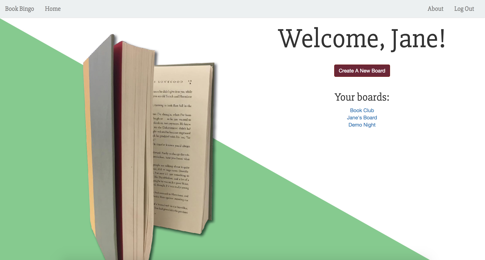
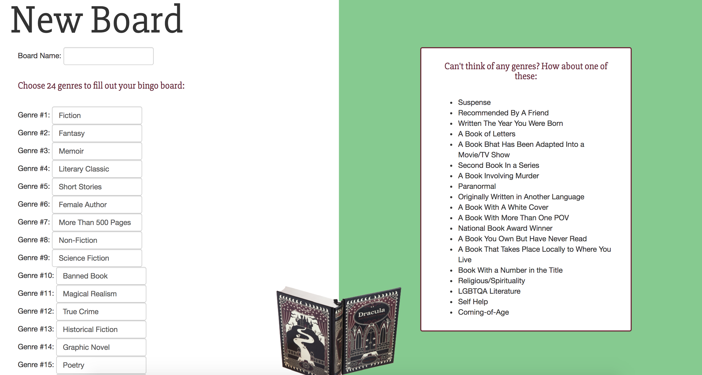
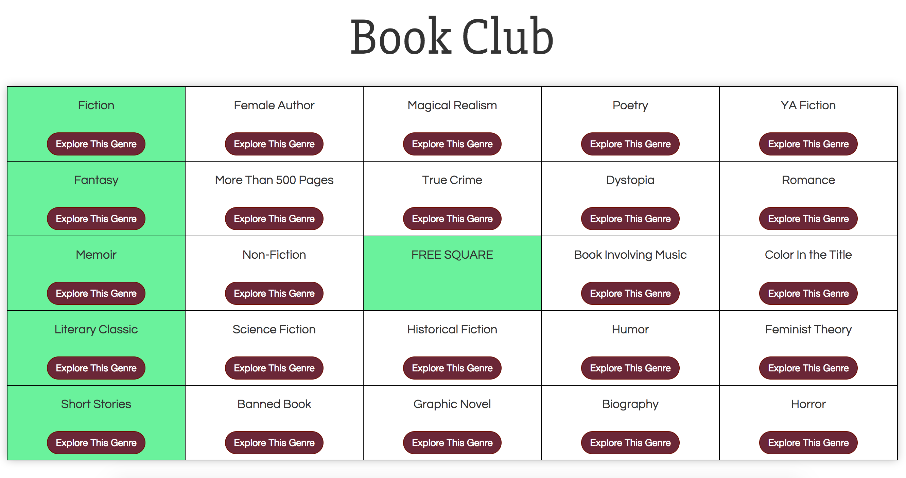
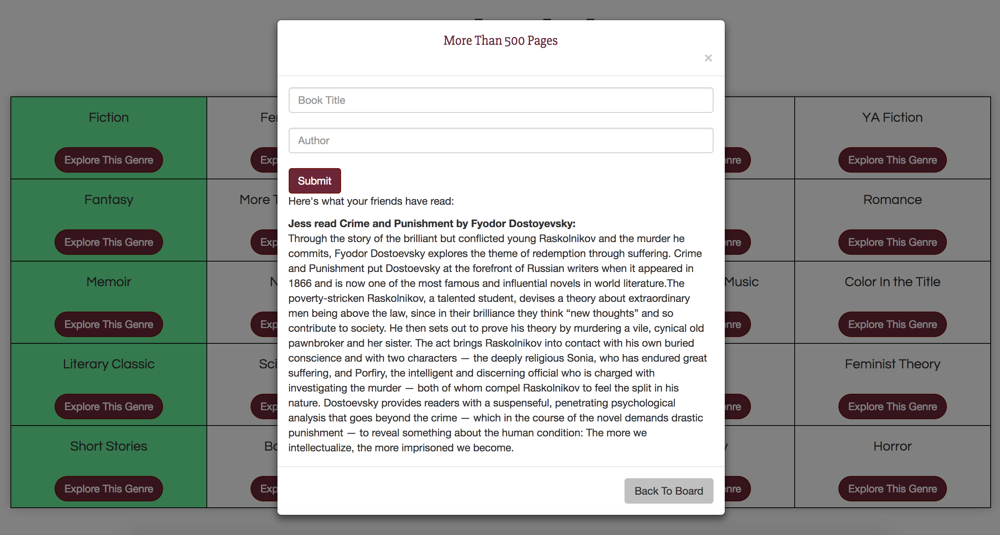
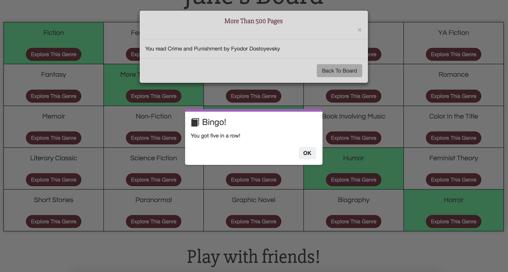
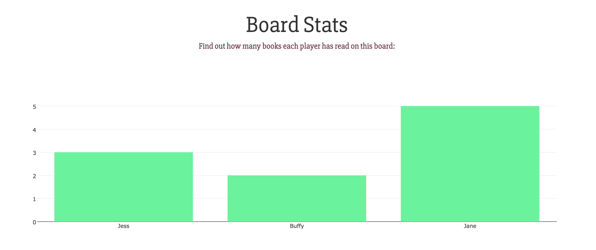
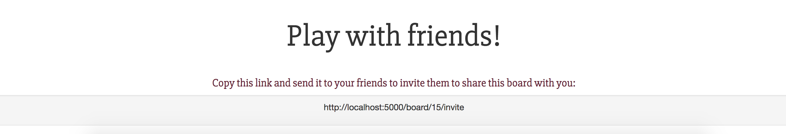

# Book Bingo

Book Bingo is a full-stack web application which makes setting reading goals fun. Upon logging in, users create customizable bingo boards in which each square to corresponds to a book genre. When the user has read a book which fits that genre, they enter the title and author into a submission form, allowing Book Bingo to connect to the Goodreads API and fetch the book's description. User information, books read, and board information are stored in a PostgreSQL database. Once a square has been read, an Ajax call provides immediate feedback on the DOM, hiding the submission form and turning the cell green. When a user has read five books in a row (vertically, horizontally, or diagonally), they get bingo! 

Users can set personal reading goals by playing on their own, or play with friends by inviting others to share their board. If a user is sharing their board, they can see descriptions of which books their friends have read for each category. 

[Click this link to play!](http://book-bingo.herokuapp.com/)

---

### Technical Stack

* Python 2.7
* Flask
* JavaScript
* PostreSQL
* SQLAlchemy
* AJAX/JSON
* JQuery
* Jinja
* Bootstrap
* HTML
* CSS
* Goodreads API
* Plotly

(Dependencies are listed in requirements.txt)

---

### Features

* User registration and login with PostgreSQL
* Flask app renders HTML and handles requests to the database
* App searches for book descriptions through the Goodreads API, and displays them on the board
* AJAX and jQuery provide real-time feedback on the DOM about which genres have been marked as read
* Modal windows provide details about each genre, including which books other users on the board have read
* Dynamic share links use sessions to allow users to invite friends to collaborate on a board
* Plotly graphs display how many books each user has read on the board

Users can log in or register from the home page:

Upon logging in, the user homepage displays that user's boards, and provides the option to create a new board:

To create a new board, choose 24 genres. Can't think of 24 genres? Not to worry - Book Bingo provides plenty of suggestions:

The genres display on a dynamic bingo board. When a category is marked as read, it turns green: 

Each cell contains a modal window with the submission form for that genre, as well as information about the books other players on the board have read in that category. These book descriptions come from the Goodreads API: 

When a user reads five books in a row, a JavaScript overlay appears to let them know that they've acheived bingo! Users can achieve bingo vertically, horizontally, or diagonally, and can get bingo several times on each board:

The Board Stats graph, created with Plotly, allows users to keep track of how many books each player has read on that board:

Each board has a share link, so users can invite friends to play with them. Share links put the board ID into the recipient's session to keep track of which board they've been invited to play on:

---
### Author

[Jessica Appelbaum](https://www.linkedin.com/in/jessapp/) is a software engineer living in San Francisco, CA.